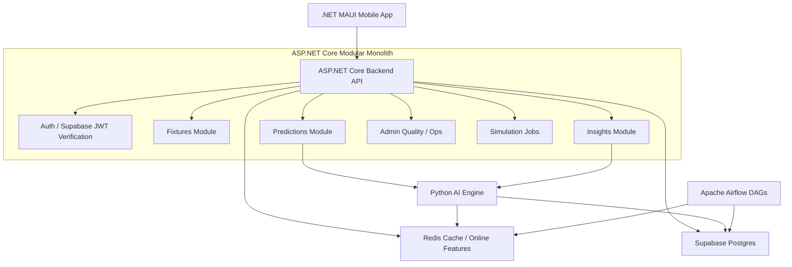

# 02. SYSTEM ARCHITECTURE — Lightweight Supabase Mobile Architecture

## 1. Architecture Diagram



## 2. Service Responsibilities

| Service | Responsibility |
|---|---|
| .NET MAUI Mobile | UI, navigation, token storage, API calling |
| ASP.NET Core Backend | API, auth, validation, orchestration, fallback, admin |
| Python AI Engine | Inference, scoreMatrix, SHAP, RAG |
| Supabase Auth | User identity, JWT, roles source |
| Supabase Postgres | Persistent data, pgvector, model registry |
| Redis | Online features, prediction cache |
| Airflow | DAGs for ETL, feature materialization, snapshots, retraining |

## 3. Removed Services

| Removed | Reason | Replacement |
|---|---|---|
| Feast | Too heavy for 16GB local; project scale manageable | Supabase Postgres + Redis |
| Qdrant | Extra vector service and RAM | Supabase Postgres + pgvector |
| MLflow Server | Not needed on hot path; heavy local service | `model_version_registry` in Supabase |

## 4. Boundary Rules

Allowed:

```text
Mobile → ASP.NET Core API
ASP.NET Core → Python AI Engine
ASP.NET Core → Supabase Postgres
ASP.NET Core → Redis
Python AI Engine → Redis
Python AI Engine → Supabase pgvector
Airflow → Supabase Postgres
Airflow → Redis
```

Forbidden:

```text
Mobile → Supabase service-role key
Mobile → direct prediction tables
Backend → model training
Backend → MLflow server
Python AI Engine → JWT issuing
Airflow → user-serving request path
```

## 5. API Gateway Decision

No business API Gateway is needed because the system exposes one public backend.

Kestrel / ASP.NET Core is production-grade. If TLS is needed, use a thin edge layer:

- Cloudflare Tunnel.
- Caddy.
- Hosting provider TLS.

That edge layer is not responsible for business routing.

## 6. Runtime Modes

### Local 16GB Mode

```text
Hosted Supabase recommended for Auth + Postgres.
Docker local:
  ASP.NET Core Backend
  Python AI Engine
  Redis
  Airflow
```

Optional offline mode:

```text
Local Postgres with pgvector can mirror Supabase schema.
```

### Staging / Production Mode

```text
Supabase hosted project
Backend container
AI Engine container
Redis managed or containerized
Airflow container/server
GitHub Actions deployment
```
