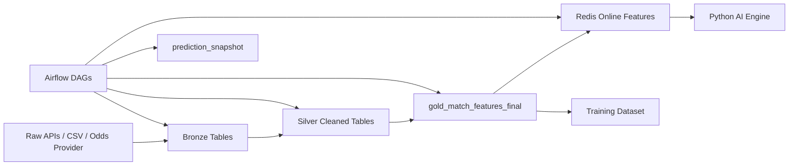

# 03. DATA PIPELINE AND SCHEMA — Airflow + Supabase + Redis

## 1. Data Pipeline Overview



## 2. Airflow DAGs

| DAG | Responsibility |
|---|---|
| `daily_ingestion_dag.py` | Pull fixtures, results, odds, team metadata |
| `feature_materialization_dag.py` | Build features and materialize upcoming matches to Redis |
| `rag_embedding_dag.py` | Build RAG documents and load embeddings to pgvector |
| `scheduled_prediction_snapshot_dag.py` | Create T-24h/T-3h/T-30m snapshots |
| `retraining_dag.py` | Train/evaluate/register/promote models |

## 3. Supabase Core Tables

| Table | Purpose |
|---|---|
| `profiles` | User profile mapped to Supabase Auth users |
| `fixtures` | Match schedule |
| `teams` | Team metadata |
| `leagues` | League metadata |
| `match_results` | Final outcomes |
| `odds_snapshot` | Market odds snapshots |
| `gold_match_features_final` | Offline feature table |
| `feature_materialization_registry` | Materialization metadata |
| `prediction_snapshot` | Immutable scheduled/on-demand prediction snapshot |
| `prediction_serve_event` | Per-request serving analytics |
| `model_version_registry` | Lightweight model registry |
| `rag_documents` | RAG sources |
| `rag_document_chunks` | RAG chunks |
| `rag_embeddings` | pgvector embeddings |
| `simulation_jobs` | Admin simulation jobs |

## 4. Offline Feature Store

```sql
CREATE TABLE gold_match_features_final (
    match_id BIGINT PRIMARY KEY,
    fixture_version TEXT NOT NULL,
    league_id BIGINT,
    season TEXT,
    kickoff_time TIMESTAMPTZ NOT NULL,
    feature_snapshot_timestamp TIMESTAMPTZ NOT NULL,
    features JSONB NOT NULL,
    created_at TIMESTAMPTZ NOT NULL DEFAULT now()
);
```

## 5. Online Feature Store in Redis

Airflow materializes features into Redis.

Key:

```text
feature:match:{matchId}:{featureMaterializationId}
```

Value:

```json
{
  "matchId": 123,
  "fixtureVersion": "fixture-2026-06-18T10:00:00Z",
  "featureMaterializationId": "featmat-2026-06-18-0955",
  "featureSnapshotTimestamp": "2026-06-18T09:55:00Z",
  "features": {
    "homeEloDiff": 72.4,
    "awayRestDays": 3,
    "homeRecentXg": 1.62
  }
}
```

## 6. Feature Materialization Registry

```sql
CREATE TABLE feature_materialization_registry (
    id BIGSERIAL PRIMARY KEY,
    feature_materialization_id TEXT NOT NULL UNIQUE,
    feature_view_name TEXT NOT NULL,
    snapshot_timestamp TIMESTAMPTZ NOT NULL,
    materialized_at TIMESTAMPTZ NOT NULL,
    status TEXT NOT NULL,
    row_count BIGINT,
    source_gold_table TEXT NOT NULL DEFAULT 'gold_match_features_final',
    created_at TIMESTAMPTZ NOT NULL DEFAULT now()
);

CREATE INDEX idx_feature_materialization_active
ON feature_materialization_registry(feature_view_name, snapshot_timestamp DESC)
WHERE status = 'SUCCESS';
```

## 7. pgvector RAG Tables

```sql
CREATE EXTENSION IF NOT EXISTS vector;

CREATE TABLE rag_documents (
    id BIGSERIAL PRIMARY KEY,
    source_type TEXT NOT NULL,
    title TEXT,
    uri TEXT,
    metadata JSONB,
    created_at TIMESTAMPTZ NOT NULL DEFAULT now()
);

CREATE TABLE rag_document_chunks (
    id BIGSERIAL PRIMARY KEY,
    document_id BIGINT NOT NULL REFERENCES rag_documents(id),
    chunk_text TEXT NOT NULL,
    metadata JSONB,
    created_at TIMESTAMPTZ NOT NULL DEFAULT now()
);

CREATE TABLE rag_embeddings (
    id BIGSERIAL PRIMARY KEY,
    chunk_id BIGINT NOT NULL REFERENCES rag_document_chunks(id),
    embedding VECTOR(384),
    created_at TIMESTAMPTZ NOT NULL DEFAULT now()
);
```

## 8. No-leakage Rules

```text
Feature for match T must use only data before T.
Rolling stats must shift before rolling.
Odds snapshot must use timestamp before prediction checkpoint.
Prediction snapshot must store checkpoint time.
Training split must be time-based, not random.
```
